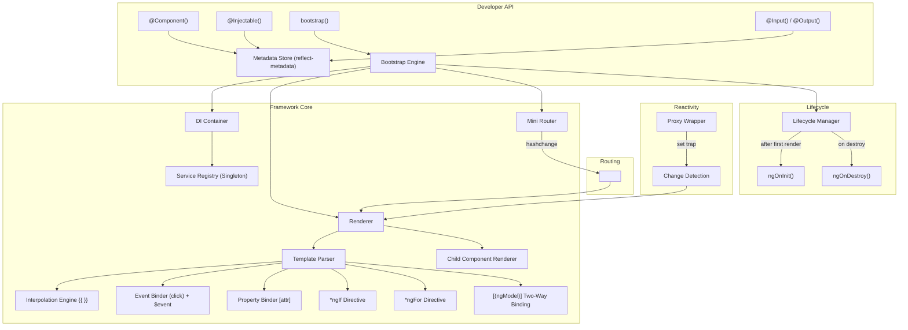
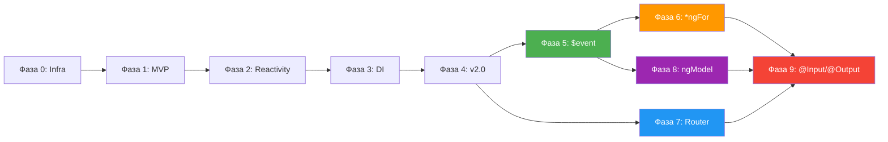

# 🅰️ MiniNG — План реализации учебного Angular-фреймворка

## Обзор архитектуры



---

## Структура проекта (целевая)

```
MiniNG/
├── src/
│   ├── core/                          # Ядро фреймворка
│   │   ├── decorators/
│   │   │   ├── component.ts          # @Component decorator
│   │   │   ├── injectable.ts         # @Injectable decorator
│   │   │   └── input-output.ts       # @Input() / @Output() decorators
│   │   ├── di/
│   │   │   └── container.ts          # IoC Container (Singleton registry)
│   │   ├── renderer/
│   │   │   ├── renderer.ts           # DOM rendering engine
│   │   │   ├── template-parser.ts    # {{ }}, (event), [prop], *ngIf, *ngFor, [(ngModel)]
│   │   │   ├── change-detection.ts   # Proxy-based reactivity
│   │   │   └── child-renderer.ts     # Вложенные компоненты + @Input/@Output
│   │   ├── directives/
│   │   │   ├── ng-if.ts              # *ngIf логика
│   │   │   └── ng-for.ts             # *ngFor логика (клонирование, очистка)
│   │   ├── router/
│   │   │   └── router.ts             # Hash-based router + <router-outlet>
│   │   ├── lifecycle/
│   │   │   └── hooks.ts              # OnInit, OnDestroy interfaces + manager
│   │   ├── bootstrap.ts              # bootstrap() entry point
│   │   └── index.ts                  # Public API barrel export
│   │
│   ├── app/                           # Demo-приложение: Mini Shop 🛒
│   │   ├── services/
│   │   │   ├── product.service.ts    # Каталог товаров (массив)
│   │   │   └── cart.service.ts       # Корзина покупок (состояние)
│   │   ├── components/
│   │   │   ├── product-card.component.ts   # Карточка товара (@Input)
│   │   │   ├── cart.component.ts           # Корзина (@Input/@Output)
│   │   │   └── search-bar.component.ts     # Поиск [(ngModel)]
│   │   ├── pages/
│   │   │   ├── catalog.component.ts  # Страница каталога (*ngFor)
│   │   │   ├── cart-page.component.ts # Страница корзины
│   │   │   └── about.component.ts    # О магазине
│   │   ├── app.component.ts          # Корневой компонент (навигация)
│   │   └── main.ts                   # Точка входа: bootstrap(AppComponent)
│   │
│   └── index.html                    # <app-root></app-root>
│
├── tsconfig.json
├── vite.config.ts
└── package.json
```

---

## Фаза 0 — Инфраструктура проекта

> **Цель:** Настроить Vite + TypeScript с поддержкой декораторов.

### Задача 0.1 — Инициализация проекта

| Параметр | Значение |
|---|---|
| **Сборщик** | Vite (vanilla-ts шаблон) |
| **TypeScript** | `experimentalDecorators: true`, `emitDecoratorMetadata: true` |
| **Зависимости** | `reflect-metadata` (единственная разрешённая) |

**Файлы:**

- `package.json` — скрипты `dev`, `build`
- `tsconfig.json` — строгая конфигурация TS с декораторами
- `vite.config.ts` — базовая конфигурация
- `src/index.html` — минимальный HTML с `<app-root></app-root>`

### Задача 0.2 — Проверка работоспособности

- Создать `src/app/main.ts` с `console.log('MiniNG framework loaded')`
- Запустить `npm run dev` и убедиться, что всё компилируется
- Проверить, что `reflect-metadata` корректно импортируется

---

## Фаза 1 — Ядро фреймворка (MVP)

> **Цель:** Запустить первый компонент с интерполяцией и обработкой событий.

### Задача 1.1 — Хранилище метаданных и `@Component`

**Файл:** `src/framework/decorators/component.ts`

```typescript
// Целевой API:
interface ComponentConfig {
  selector: string;   // e.g. 'app-root'
  template: string;   // HTML-строка с {{ }} и (event)
}

// Использование:
@Component({
  selector: 'app-root',
  template: `<h1>{{ title }}</h1><button (click)="onClick()">Click</button>`
})
class AppComponent {
  title = 'Hello MiniNG';
  onClick() { console.log('clicked!'); }
}
```

**Реализация:**
- Использовать `Reflect.defineMetadata()` для сохранения `ComponentConfig` на классе
- Ключ метаданных: `Symbol('component:config')`
- Вспомогательная функция `getComponentConfig(target)` для чтения

### Задача 1.2 — Template Parser (интерполяция)

**Файл:** `src/framework/renderer/template-parser.ts`

**Алгоритм:**
1. Получить строку `template` из метаданных
2. Создать временный `<template>` элемент, записать HTML
3. Обойти все `Text` ноды через `TreeWalker`
4. Для каждой ноды с паттерном `{{ propName }}` — заменить на значение из экземпляра
5. Сохранить маппинг `{ node, expression }` для последующих обновлений

```typescript
// Regex для поиска интерполяций
const INTERPOLATION_RE = /\{\{\s*(\w+)\s*\}\}/g;
```

### Задача 1.3 — Template Parser (события)

**Файл:** тот же `template-parser.ts`

**Алгоритм:**
1. После парсинга DOM — обойти все элементы
2. Найти атрибуты формата `(eventName)="methodName()"`
3. Извлечь имя события и метода через regex
4. Вызвать `element.addEventListener(eventName, instance[methodName].bind(instance))`
5. Удалить синтетический атрибут из DOM

```typescript
// Regex для атрибутов событий
const EVENT_BINDING_RE = /^\((\w+)\)$/;         // для имени атрибута
const METHOD_CALL_RE = /^(\w+)\(\)$/;           // для значения
```

### Задача 1.4 — Renderer

**Файл:** `src/framework/renderer/renderer.ts`

**Ответственность:**
- Принимает класс компонента и DOM-элемент хоста
- Создаёт экземпляр класса (пока без DI)
- Вызывает template-parser для получения готового DOM-фрагмента
- Монтирует фрагмент в хост-элемент
- Возвращает объект `ComponentRef` с ссылками на экземпляр и DOM

```typescript
interface ComponentRef {
  instance: any;
  hostElement: HTMLElement;
  bindings: InterpolationBinding[];  // для change detection
}
```

### Задача 1.5 — `bootstrap()`

**Файл:** `src/framework/bootstrap.ts`

**Алгоритм:**
1. Прочитать `selector` из метаданных класса
2. `document.querySelector(selector)` — найти хост-элемент
3. Если не найден — бросить понятную ошибку
4. Вызвать `Renderer.render(RootComponent, hostElement)`

```typescript
// Целевой API:
import { bootstrap } from './framework';
import { AppComponent } from './app/app.component';

bootstrap(AppComponent);
```

### ✅ Контрольная точка Фазы 1

Должно работать:
```typescript
@Component({
  selector: 'app-root',
  template: `
    <h1>{{ title }}</h1>
    <p>{{ description }}</p>
    <button (click)="greet()">Say Hello</button>
  `
})
class AppComponent {
  title = 'MiniNG Framework';
  description = 'My own Angular!';
  greet() { alert('Hello from MiniNG!'); }
}

bootstrap(AppComponent);
```

---

## Фаза 2 — Реактивность (Change Detection)

> **Цель:** Автоматически обновлять DOM при изменении свойств компонента.

### Задача 2.1 — Ручной `detectChanges()` (базовый вариант)

**Файл:** `src/framework/renderer/change-detection.ts`

**Реализация:**
- Функция `updateBindings(bindings, instance)` — обходит все сохранённые `InterpolationBinding` и обновляет `textContent`
- Renderer добавляет метод `detectChanges()` в экземпляр компонента

```typescript
// Использование:
onClick() {
  this.counter++;
  this.detectChanges();  // ← ручной вызов
}
```

### Задача 2.2 — Proxy-обёртка (продвинутый вариант)

**Файл:** тот же `change-detection.ts`

**Алгоритм:**
1. После создания экземпляра — обернуть его в `Proxy`
2. В `set` trap — сохранить значение и запланировать обновление через `queueMicrotask()`
3. Использовать флаг `pendingUpdate` чтобы схлопнуть множественные изменения в один цикл перерисовки (batching)

```typescript
function createReactiveProxy(instance: any, onUpdate: () => void): any {
  let pendingUpdate = false;
  return new Proxy(instance, {
    set(target, prop, value) {
      target[prop] = value;
      if (!pendingUpdate) {
        pendingUpdate = true;
        queueMicrotask(() => {
          onUpdate();
          pendingUpdate = false;
        });
      }
      return true;
    }
  });
}
```

### ✅ Контрольная точка Фазы 2

```typescript
@Component({
  selector: 'app-root',
  template: `
    <h1>Count: {{ count }}</h1>
    <button (click)="increment()">+1</button>
  `
})
class AppComponent {
  count = 0;
  increment() {
    this.count++;  // DOM обновляется автоматически!
  }
}
```

---

## Фаза 3 — Dependency Injection

> **Цель:** Реализовать IoC-контейнер с singleton-сервисами и constructor injection.

### Задача 3.1 — `@Injectable()` декоратор

**Файл:** `src/framework/decorators/injectable.ts`

```typescript
function Injectable(): ClassDecorator {
  return (target) => {
    Reflect.defineMetadata('injectable', true, target);
  };
}
```

### Задача 3.2 — DI Container

**Файл:** `src/framework/di/container.ts`

**API контейнера:**

```typescript
class DIContainer {
  private registry = new Map<Function, any>();  // class → singleton instance

  resolve<T>(target: new (...args: any[]) => T): T {
    // 1. Проверить registry — если есть, вернуть
    // 2. Прочитать Reflect.getMetadata('design:paramtypes', target)
    // 3. Рекурсивно resolve каждый параметр
    // 4. new target(...resolvedDeps)
    // 5. Сохранить в registry
    // 6. Вернуть
  }
}
```

**Важно:** `emitDecoratorMetadata: true` в tsconfig заставит TypeScript генерировать метаданные `design:paramtypes`, которые `reflect-metadata` сможет прочитать.

### Задача 3.3 — Интеграция DI в Renderer

- Модифицировать `Renderer.render()` — вместо прямого `new Component()` использовать `container.resolve(Component)`
- Контейнер автоматически разрешит все зависимости конструктора

### ✅ Контрольная точка Фазы 3

```typescript
@Injectable()
class CounterService {
  private value = 0;
  increment() { return ++this.value; }
  getValue() { return this.value; }
}

@Component({
  selector: 'app-root',
  template: `<h1>{{ count }}</h1><button (click)="inc()">+1</button>`
})
class AppComponent {
  count = 0;
  constructor(private counterService: CounterService) {
    this.count = this.counterService.getValue();
  }
  inc() {
    this.count = this.counterService.increment();
  }
}
```

---

## Фаза 4 — Расширения v2.0

> **Цель:** Добавить lifecycle hooks, property binding и `*ngIf`.

### Задача 4.1 — `OnInit` Lifecycle Hook

**Файл:** `src/framework/lifecycle/hooks.ts`

```typescript
interface OnInit {
  ngOnInit(): void;
}
```

**Интеграция в Renderer:**
- После монтирования DOM — проверить `if ('ngOnInit' in instance)`
- Вызвать `instance.ngOnInit()` в `queueMicrotask()` (после текущего цикла рендера)

### Задача 4.2 — Property Binding `[attr]="expr"`

**Файл:** дополнение к `template-parser.ts`

**Алгоритм:**
1. Найти атрибуты формата `[attrName]="propertyName"`
2. Для boolean-атрибутов (`disabled`, `hidden`) — добавлять/удалять атрибут
3. Для остальных — устанавливать значение через `element.setAttribute()`
4. Сохранить маппинг для change detection

```typescript
const PROP_BINDING_RE = /^\[(\w+)\]$/;  // для имени атрибута
```

### Задача 4.3 — `*ngIf` директива

**Файл:** дополнение к `template-parser.ts`

**Алгоритм:**
1. Найти элементы с атрибутом `*ngIf="propertyName"`
2. Создать `Comment` ноду как якорь: `<!-- ngIf: propertyName -->`
3. Если значение `truthy` — вставить элемент после комментария
4. Если `falsy` — удалить элемент, оставить только комментарий
5. При change detection — переоценить и обновить

```typescript
interface NgIfBinding {
  anchor: Comment;          // якорь в DOM
  templateElement: Element; // оригинальный элемент (клон)
  expression: string;       // имя свойства
  isAttached: boolean;      // текущее состояние
}
```

### ✅ Контрольная точка Фазы 4

```typescript
@Component({
  selector: 'app-root',
  template: `
    <h1>{{ title }}</h1>
    <div *ngIf="showDetails">
      <p>Secret details revealed!</p>
    </div>
    <button (click)="toggle()" [disabled]="isLocked">Toggle</button>
  `
})
class AppComponent implements OnInit {
  title = '';
  showDetails = false;
  isLocked = false;

  ngOnInit() {
    this.title = 'Loaded via OnInit!';
  }

  toggle() {
    this.showDetails = !this.showDetails;
  }
}
```

---

## Порядок выполнения (Roadmap)

| # | Фаза | Задачи | Ключевой результат |
|---|---|---|---|
| 0 | Инфраструктура | 0.1 — 0.2 | Vite + TS + декораторы работают |
| 1 | Ядро MVP | 1.1 — 1.5 | Компонент рендерится с `{{ }}` и `(click)` |
| 2 | Реактивность | 2.1 — 2.2 | DOM обновляется автоматически при изменении свойств |
| 3 | DI | 3.1 — 3.3 | Сервисы внедряются через конструктор |
| 4 | v2.0 | 4.1 — 4.3 | `OnInit`, `[prop]`, `*ngIf` |
| **5** | **Объект `$event`** | **5.1 — 5.2** | **В обработчиках доступен нативный DOM-event** |
| **6** | **`*ngFor`** | **6.1 — 6.3** | **Рендеринг списков по массиву с очисткой** |
| **7** | **Mini Router** | **7.1 — 7.3** | **Hash-роутинг + `<router-outlet>`** |
| **8** | **`[(ngModel)]`** | **8.1 — 8.2** | **Двустороннее связывание для форм** |
| **9** | **`@Input` / `@Output`** | **9.1 — 9.4** | **Вложенные компоненты с передачей данных** |

> [!IMPORTANT]
> Каждая фаза завершается контрольной точкой — работающим демо-примером, который подтверждает корректность реализации.

> [!TIP]
> Рекомендуемый подход: реализовывать фазы строго последовательно. Каждая следующая фаза опирается на артефакты предыдущей.

> [!NOTE]
> Начиная с Фазы 6, демо-приложение постепенно превращается в **Mini Shop 🛒** — маленький интернет-магазин, демонстрирующий все возможности фреймворка на реалистичном примере.

---

## Фаза 5 — Объект `$event` в шаблонах

> **Цель:** Прокинуть нативный DOM-event в обработчики шаблона для `preventDefault()`, чтения значений инпутов и т.д.

### Задача 5.1 — Расширение парсера событий

**Файл:** дополнение к `template-parser.ts`

**Текущее поведение:**
```typescript
// Сейчас парсер поддерживает только: (click)="methodName()"
const METHOD_CALL_RE = /^(\w+)\(\)$/;
```

**Новое поведение:**
```typescript
// Поддержка: (click)="onClick($event)" и (input)="onInput($event)"
const METHOD_CALL_RE = /^(\w+)\((\$event)?\)$/;
```

**Алгоритм:**
1. При парсинге атрибута `(eventName)="handler($event)"` — определить, что передаётся `$event`
2. В `addEventListener` — передать нативный `Event` объект первым аргументом метода
3. Если `$event` не указан — вызывать метод без аргументов (обратная совместимость)

```typescript
// Реализация в парсере:
element.addEventListener(eventName, (event: Event) => {
  if (hasEventArg) {
    instance[methodName].call(instance, event);
  } else {
    instance[methodName].call(instance);
  }
});
```

### Задача 5.2 — Поддержка нескольких типов событий

Помимо `click`, добавить поддержку: `input`, `change`, `submit`, `keydown`, `keyup`, `mouseover`, `mouseout`.

Парсер уже универсален по имени события, поэтому изменения минимальны — нужно только протестировать.

### ✅ Контрольная точка Фазы 5

```typescript
@Component({
  selector: 'app-root',
  template: `
    <h1>{{ title }}</h1>
    <button (click)="onClick($event)">Click Me</button>
    <input (input)="onInput($event)" />
    <p>You typed: {{ typed }}</p>
  `
})
class AppComponent {
  title = 'Event Demo';
  typed = '';

  onClick(event: MouseEvent) {
    event.preventDefault();
    console.log('Clicked at:', event.clientX, event.clientY);
  }

  onInput(event: Event) {
    this.typed = (event.target as HTMLInputElement).value;
  }
}
```

---

## Фаза 6 — Структурная директива `*ngFor`

> **Цель:** Отрисовывать списки элементов по массиву с поддержкой динамического обновления, клонирования DOM и очистки памяти.

### Задача 6.1 — Парсинг синтаксиса `*ngFor`

**Файл:** `src/core/directives/ng-for.ts`

**Синтаксис:** `*ngFor="let item of items"`

**Алгоритм парсинга:**
1. Найти элементы с атрибутом `*ngFor`
2. Распарсить выражение regex: `/let\s+(\w+)\s+of\s+(\w+)/`
3. Извлечь имя переменной итерации (`item`) и имя массива (`items`)
4. Сохранить оригинальный элемент как шаблон (клон)
5. Создать `Comment`-якорь `<!-- ngFor: let item of items -->`

```typescript
interface NgForBinding {
  anchor: Comment;              // якорь в DOM
  templateElement: Element;     // шаблон элемента (клон)
  itemVar: string;              // 'item' — имя переменной
  arrayProp: string;            // 'items' — свойство компонента
  renderedNodes: Element[];     // текущие отрендеренные элементы
}

const NGFOR_RE = /let\s+(\w+)\s+of\s+(\w+)/;
```

### Задача 6.2 — Рендеринг и обновление списка

**Алгоритм рендеринга:**
1. Для каждого элемента массива — глубоко клонировать шаблон (`templateElement.cloneNode(true)`)
2. Внутри клона заменить интерполяции `{{ item.name }}` на значения из текущего элемента
3. Вставить все клоны после якоря в DOM
4. Сохранить ссылки на вставленные ноды в `renderedNodes`

**Алгоритм обновления (при change detection):**
1. Удалить все элементы из `renderedNodes` из DOM
2. Очистить массив `renderedNodes`
3. Перерисовать заново по текущему массиву
4. *(Оптимизация в будущем: diffing по индексу или trackBy)*

```typescript
function renderNgFor(binding: NgForBinding, instance: any): void {
  // 1. Очистить предыдущие
  binding.renderedNodes.forEach(node => node.remove());
  binding.renderedNodes = [];

  // 2. Получить массив
  const array = instance[binding.arrayProp] as any[];
  if (!Array.isArray(array)) return;

  // 3. Рендерить каждый элемент
  const parent = binding.anchor.parentNode!;
  let insertBefore = binding.anchor.nextSibling;

  for (const item of array) {
    const clone = binding.templateElement.cloneNode(true) as Element;
    // Заменить {{ item.prop }} на значения
    replaceInterpolationsInClone(clone, binding.itemVar, item);
    parent.insertBefore(clone, insertBefore);
    binding.renderedNodes.push(clone);
  }
}
```

### Задача 6.3 — Интеграция с Proxy и поддержка массивных операций

**Проблема:** `Proxy` на объекте ловит `set`, но `array.push()`, `splice()`, `pop()` мутируют массив через внутренние слоты.

**Решение:** Обернуть массивы в отдельный Proxy, перехватывая мутирующие методы:

```typescript
function createArrayProxy(array: any[], onChange: () => void): any[] {
  return new Proxy(array, {
    get(target, prop) {
      const value = target[prop as any];
      if (['push', 'pop', 'splice', 'shift', 'unshift'].includes(prop as string)) {
        return (...args: any[]) => {
          const result = (value as Function).apply(target, args);
          onChange();  // Запускаем change detection
          return result;
        };
      }
      return value;
    },
    set(target, prop, value) {
      target[prop as any] = value;
      onChange();
      return true;
    }
  });
}
```

### ✅ Контрольная точка Фазы 6

```typescript
@Injectable()
class ProductService {
  private products = [
    { id: 1, name: 'TypeScript Handbook', price: 29 },
    { id: 2, name: 'Angular Stickers', price: 5 },
    { id: 3, name: 'Mechanical Keyboard', price: 120 },
  ];
  getAll() { return this.products; }
}

@Component({
  selector: 'app-root',
  template: `
    <h1>Mini Shop 🛒</h1>
    <div class="product-list">
      <div class="card" *ngFor="let product of products">
        <h3>{{ product.name }}</h3>
        <p>{{ product.price }} $</p>
        <button (click)="addToCart(product)">В корзину</button>
      </div>
    </div>
    <p>В корзине: {{ cartCount }} товаров</p>
  `
})
class AppComponent implements OnInit {
  products: any[] = [];
  cartCount = 0;
  constructor(private productService: ProductService) {}
  ngOnInit() { this.products = this.productService.getAll(); }
  addToCart(product: any) { this.cartCount++; }
}
```

---

## Фаза 7 — Маршрутизация (Mini Router)

> **Цель:** Создать базовый hash-роутер для переключения «страниц» без перезагрузки.

### Задача 7.1 — Класс `Router` и конфигурация маршрутов

**Файл:** `src/core/router/router.ts`

```typescript
interface Route {
  path: string;           // e.g. 'catalog', 'cart', 'about'
  component: Function;    // класс компонента
}

@Injectable()
class Router {
  private routes: Route[] = [];
  private outletElement: HTMLElement | null = null;
  private currentComponentRef: ComponentRef | null = null;

  configure(routes: Route[]): void {
    this.routes = routes;
    window.addEventListener('hashchange', () => this.onHashChange());
    // Начальный рендер
    this.onHashChange();
  }

  private onHashChange(): void {
    const hash = window.location.hash.slice(1) || '';  // убираем '#'
    const route = this.routes.find(r => r.path === hash);
    if (route && this.outletElement) {
      this.renderRoute(route);
    }
  }

  navigate(path: string): void {
    window.location.hash = `#${path}`;
  }
}
```

### Задача 7.2 — Элемент `<router-outlet>`

**Алгоритм:**
1. При `bootstrap()` — найти `<router-outlet>` внутри шаблона корневого компонента
2. Сохранить ссылку на этот элемент в `Router`
3. При переходе — очистить содержимое outlet и отрендерить новый компонент
4. Перед очисткой — вызвать `ngOnDestroy()` у текущего компонента (если реализован)

```typescript
interface OnDestroy {
  ngOnDestroy(): void;
}

// В Router:
private renderRoute(route: Route): void {
  // 1. Очистка
  if (this.currentComponentRef) {
    const inst = this.currentComponentRef.instance;
    if ('ngOnDestroy' in inst) inst.ngOnDestroy();
    this.outletElement!.innerHTML = '';
  }
  // 2. Рендер нового компонента
  this.currentComponentRef = Renderer.render(route.component, this.outletElement!);
}
```

### Задача 7.3 — Навигационные ссылки

Поддержка атрибута `[routerLink]="'path'"` на элементах `<a>`:

```typescript
// В template-parser добавить обработку:
// <a [routerLink]="'catalog'">Каталог</a>
// → element.addEventListener('click', (e) => { e.preventDefault(); router.navigate('catalog'); })
```

### ✅ Контрольная точка Фазы 7

```typescript
// pages/catalog.component.ts
@Component({
  selector: 'page-catalog',
  template: `<h2>Каталог товаров</h2><div *ngFor="let p of products">{{ p.name }}</div>`
})
class CatalogComponent implements OnInit { /* ... */ }

// pages/cart-page.component.ts
@Component({
  selector: 'page-cart',
  template: `<h2>Корзина</h2><p>Товаров: {{ count }}</p>`
})
class CartPageComponent { /* ... */ }

// app.component.ts
@Component({
  selector: 'app-root',
  template: `
    <nav>
      <a [routerLink]="'catalog'">Каталог</a>
      <a [routerLink]="'cart'">Корзина</a>
      <a [routerLink]="'about'">О нас</a>
    </nav>
    <router-outlet></router-outlet>
  `
})
class AppComponent implements OnInit {
  constructor(private router: Router) {}
  ngOnInit() {
    this.router.configure([
      { path: 'catalog', component: CatalogComponent },
      { path: 'cart', component: CartPageComponent },
      { path: 'about', component: AboutComponent },
    ]);
  }
}
```

---

## Фаза 8 — Двустороннее связывание `[(ngModel)]`

> **Цель:** Реализовать удобную работу с формами — синхронизация значения инпута и свойства компонента в обе стороны.

### Задача 8.1 — Парсинг синтаксиса `[(ngModel)]`

**Файл:** дополнение к `template-parser.ts`

**Синтаксис:** `<input [(ngModel)]="searchQuery" />`

**Это «синтаксический сахар» для двух биндингов:**
- `[value]="searchQuery"` — установка значения из компонента в DOM
- `(input)="searchQuery = $event.target.value"` — обновление свойства из DOM в компонент

```typescript
const NGMODEL_RE = /^\[\(ngModel\)\]$/;  // для имени атрибута

interface NgModelBinding {
  element: HTMLInputElement | HTMLTextAreaElement | HTMLSelectElement;
  property: string;        // имя свойства компонента
}
```

### Задача 8.2 — Реализация двусторонней синхронизации

**Алгоритм:**
1. Найти элементы с атрибутом `[(ngModel)]="propName"`
2. Установить `element.value = instance[propName]`
3. Добавить слушатель на `input` (для text/textarea) или `change` (для select/checkbox)
4. В обработчике — записать новое значение в `instance[propName]`
5. Proxy автоматически запустит change detection
6. При change detection — обновить `element.value` если изменилось программно

```typescript
function bindNgModel(element: HTMLElement, propName: string, instance: any): NgModelBinding {
  const input = element as HTMLInputElement;

  // Component → DOM
  input.value = instance[propName] ?? '';

  // DOM → Component
  const eventName = (input.type === 'checkbox' || input.tagName === 'SELECT') ? 'change' : 'input';

  input.addEventListener(eventName, (event: Event) => {
    const target = event.target as HTMLInputElement;
    if (input.type === 'checkbox') {
      instance[propName] = target.checked;
    } else {
      instance[propName] = target.value;
    }
  });

  return { element: input, property: propName };
}
```

### ✅ Контрольная точка Фазы 8

```typescript
@Component({
  selector: 'search-bar',
  template: `
    <div class="search">
      <input [(ngModel)]="query" placeholder="Поиск товаров..." />
      <p *ngIf="query">Ищем: {{ query }}</p>
    </div>
  `
})
class SearchBarComponent {
  query = '';
}
```

---

## Фаза 9 — Компонентные `@Input()` и `@Output()`

> **Цель:** Научить компоненты получать данные от родителя (`@Input`) и отправлять события наверх (`@Output`). Включает рендеринг вложенных (дочерних) компонентов.

### Задача 9.1 — Декораторы `@Input()` и `@Output()`

**Файл:** `src/core/decorators/input-output.ts`

```typescript
const INPUT_META_KEY = Symbol('input:props');
const OUTPUT_META_KEY = Symbol('output:events');

function Input(): PropertyDecorator {
  return (target, propertyKey) => {
    const inputs = Reflect.getMetadata(INPUT_META_KEY, target.constructor) || [];
    inputs.push(propertyKey);
    Reflect.defineMetadata(INPUT_META_KEY, inputs, target.constructor);
  };
}

function Output(): PropertyDecorator {
  return (target, propertyKey) => {
    const outputs = Reflect.getMetadata(OUTPUT_META_KEY, target.constructor) || [];
    outputs.push(propertyKey);
    Reflect.defineMetadata(OUTPUT_META_KEY, outputs, target.constructor);
  };
}
```

### Задача 9.2 — Класс `EventEmitter`

```typescript
class EventEmitter<T = any> {
  private listeners: ((value: T) => void)[] = [];

  emit(value: T): void {
    this.listeners.forEach(fn => fn(value));
  }

  subscribe(fn: (value: T) => void): void {
    this.listeners.push(fn);
  }
}
```

### Задача 9.3 — Рендеринг вложенных компонентов

**Файл:** `src/core/renderer/child-renderer.ts`

**Алгоритм:**
1. После парсинга шаблона — искать неизвестные теги, совпадающие с `selector` зарегистрированных компонентов
2. Для каждого найденного тега — создать экземпляр дочернего компонента через DI
3. Прочитать атрибуты `[inputProp]="parentExpr"` — установить значения `@Input`
4. Прочитать атрибуты `(outputEvent)="parentHandler($event)"` — подписаться на `@Output`
5. Отрендерить шаблон дочернего компонента внутри его тега

```typescript
// Реестр компонентов (заполняется при bootstrap или через конфигурацию)
const componentRegistry = new Map<string, Function>();

function registerComponent(componentClass: Function): void {
  const config = getComponentConfig(componentClass);
  if (config) {
    componentRegistry.set(config.selector, componentClass);
  }
}
```

### Задача 9.4 — Расширение `@Component` для declarations

Добавить поле `declarations` в `ComponentConfig` для регистрации дочерних компонентов:

```typescript
interface ComponentConfig {
  selector: string;
  template: string;
  declarations?: Function[];  // дочерние компоненты
}

// Использование:
@Component({
  selector: 'app-root',
  template: `...`,
  declarations: [ProductCardComponent, CartComponent]
})
class AppComponent {}
```

### ✅ Контрольная точка Фазы 9 — Итоговый Mini Shop 🛒

```typescript
// ─── Дочерний компонент: Карточка товара ─────────
@Component({
  selector: 'product-card',
  template: `
    <div class="card">
      <h3>{{ name }}</h3>
      <p class="price">{{ price }} $</p>
      <button (click)="onAdd()">В корзину</button>
    </div>
  `
})
class ProductCardComponent {
  @Input() name = '';
  @Input() price = 0;
  @Output() addToCart = new EventEmitter<void>();

  onAdd() {
    this.addToCart.emit();
  }
}

// ─── Родительский компонент: Каталог ─────────────
@Component({
  selector: 'page-catalog',
  template: `
    <input [(ngModel)]="search" placeholder="Поиск..." />
    <div *ngFor="let product of filtered">
      <product-card
        [name]="product.name"
        [price]="product.price"
        (addToCart)="onAddToCart(product)"
      ></product-card>
    </div>
    <p>В корзине: {{ cartCount }} шт.</p>
  `,
  declarations: [ProductCardComponent]
})
class CatalogComponent implements OnInit {
  products: Product[] = [];
  filtered: Product[] = [];
  search = '';
  cartCount = 0;

  constructor(
    private productService: ProductService,
    private cartService: CartService
  ) {}

  ngOnInit() {
    this.products = this.productService.getAll();
    this.filtered = this.products;
  }

  onAddToCart(product: Product) {
    this.cartService.add(product);
    this.cartCount = this.cartService.getCount();
  }
}
```

---

## Зависимости между фазами



> [!WARNING]
> Фаза 9 (`@Input/@Output`) — самая сложная. Она объединяет всё: вложенный рендеринг, DI, change detection и систему событий. Рекомендуется приступать к ней последней.

